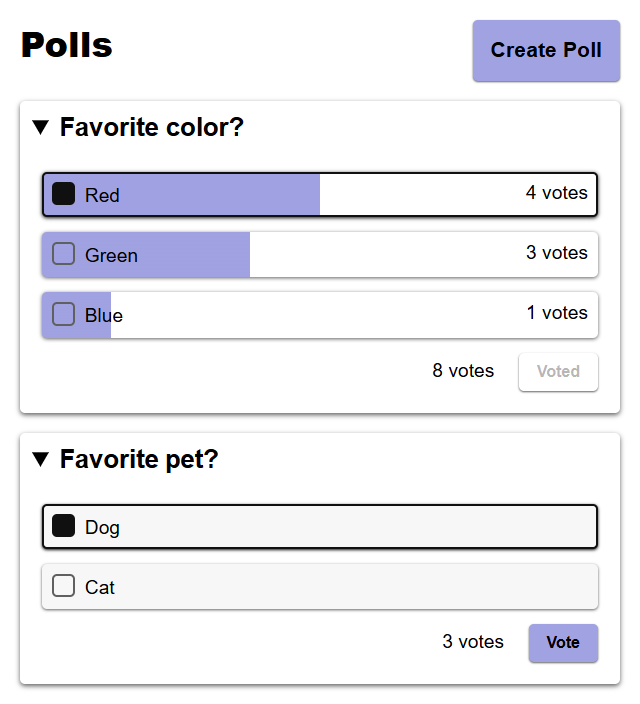

## DAT250: Software Technology Experiment Assignment 7

### PostgreSQL docker image

**Running image**

- name: expass7-postgres
- port: 5432
- password: secret
- mount: schema.up.sql

```PowerShell
>> docker run --rm -d 
    --name expass7-postgres 
    --net expass7-bridge
    -p 5432:5432 
    -e POSTGRES_PASSWORD=secret 
    --mount "type=bind,
        src=$(pwd)/schema.up.sql,
        target=/docker-entrypoint-initdb.d/schema.up.sql"
    postgres
    
ba59f0e160cc933aa58420273eca6d941b7bd5e47485fcb8cf40d950bcc84942
```

### Building image from Dockerfile

**[Dockerfile](Dockerfile)**
```Dockerfile
FROM gradle:8-jdk21 AS builder

WORKDIR /home/gradle
COPY settings.gradle.kts gradlew build.gradle.kts .
COPY src src
COPY gradle gradle

RUN ./gradlew bootjar
RUN mv build/libs/expass7-0.0.1-SNAPSHOT.jar app.jar

FROM eclipse-temurin:21-alpine

RUN addgroup -g 1000 app
RUN adduser -G app -D -u 1000 -h /app app

USER app
WORKDIR /app
COPY --from=builder --chown=1000:1000 /home/gradle/app.jar .

CMD ["java", "-jar", "app.jar"]
```

**Building and running**

```PowerShell
>> docker build -t app .

>> docker run --rm -p 8080:8080 
    --name expass7-app
    --net expass7-bridge
    -e DB_HOST=expass7-postgres
    -e DB_PORT=5432 
    -e DB_NAME=postgres 
    -e DB_USER=postgres 
    -e DB_PASS=secret 
    app
```

### Docker compose

**[docker-compose.yml](docker-compose.yml)**
```yaml
services:
  expass7-postgres:
    image: postgres
    environment:
      POSTGRES_PASSWORD: secret
    ports:
      - "5432:5432"
    volumes:
      - type: bind
        source: ./schema.up.sql
        target: /docker-entrypoint-initdb.d/schema.up.sql
  expass7-app:
    build: .
    environment:
      DB_HOST: expass7-postgres
      DB_PORT: 5432
      DB_NAME: postgres
      DB_USER: postgres
      DB_PASS: secret
    ports:
      - "8080:8080"
networks:
  expass7-bridge:
```

```PowerShell
>> docker compose up
```

**Result**


